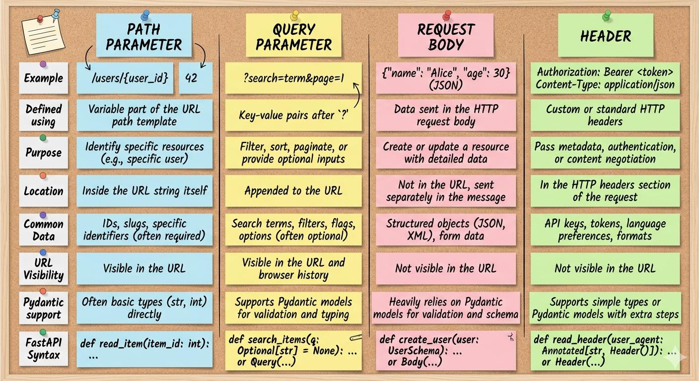

# FastAPI + React Full-Stack Application

[](https://python.org)
[](https://fastapi.tiangolo.com)
[](https://react.dev)
[](https://www.typescriptlang.org/)
[](https://vitejs.dev/)
[](https://github.com/astral-sh/uv)
[](LICENSE)

A modern, full-stack web application workspace combining a high-performance **FastAPI** backend with a responsive **React 19 & TypeScript** frontend. Built for rapid development, testing API integrations, and scalable layered architecture.

---

<p align="center">
  
</p>

---

## 📋 Table of Contents

- [Features](#-features)
- [Tech Stack](#-tech-stack)
- [Project Architecture](#-project-architecture)
- [Getting Started](#-getting-started)
  - [Prerequisites](#prerequisites)
  - [Backend Setup](#backend-setup)
  - [Frontend Setup](#frontend-setup)
- [API Reference](#-api-reference)
- [Testing](#-testing)
- [License](#-license)

---

## ⚡ Features

- **High-Performance FastAPI Backend**: Async-ready Python backend powered by Uvicorn and Pydantic v2 validation.
- **Modern React 19 Frontend**: Built with TypeScript, Vite HMR, and React Router v7 for seamless client-side navigation.
- **Blazing Fast Package Management**: Python dependencies managed with **[uv](https://github.com/astral-sh/uv)** for fast virtual environment management and deterministic locks.
- **Layered Architecture**: Clean separation of concerns across API endpoints, data models, services, and web routers.
- **Interactive UI Testing**: Dynamic forms and components for real-time testing of backend API responses.
- **Built-in API Docs**: Auto-generated interactive OpenAPI docs available via Swagger UI and ReDoc.
- **Code Quality & Testing**: Configured with `pytest`, `black` code formatter, and `oxlint` for frontend linting.

---

## 🛠️ Tech Stack

### Backend
- **Framework**: [FastAPI](https://fastapi.tiangolo.com/) (v0.141+)
- **Language**: Python 3.12+
- **ASGI Server**: [Uvicorn](https://www.uvicorn.org/)
- **Package Manager**: [uv](https://github.com/astral-sh/uv)
- **Data Validation**: [Pydantic](https://docs.pydantic.dev/)
- **Testing & Tooling**: Pytest, HTTPX, Black

### Frontend
- **Framework**: [React 19](https://react.dev/)
- **Language**: [TypeScript](https://www.typescriptlang.org/)
- **Build Tool**: [Vite](https://vitejs.dev/)
- **Routing**: React Router DOM (v7+)
- **Linter**: Oxlint

---

## 📁 Project Architecture

```text
FASTAPI/
├── assets/                       # Static media assets & documentation references
│   ├── FastAPI.png               # Project banner image
│   └── fastapi-modern-python-web-development.pdf # Reference documentation
├── backend/                      # FastAPI Python Application
│   ├── pyproject.toml            # Backend dependencies & scripts configuration
│   ├── uv.lock                   # Deterministic package lockfile
│   └── src/                      # Source code
│       ├── main.py               # FastAPI entrypoint & CORS middleware configuration
│       ├── api/                  # API endpoints and middleware
│       │   └── endpoints/        # Route controllers (e.g. /hi, /agent, /header)
│       ├── model/                # Pydantic data schemas (Tag, TagIn, TagOut)
│       ├── service/              # Business logic & in-memory services
│       ├── web/                  # Router handlers
│       └── test/                 # Test suite & pytest fixtures
├── frontend/                     # React + Vite TypeScript Application
│   ├── package.json              # Frontend dependencies and scripts
│   ├── vite.config.ts            # Vite configuration
│   ├── .oxlintrc.json            # Oxlint rule configuration
│   └── src/                      # React source code
│       ├── App.tsx               # Main application router
│       ├── api/                  # API client helpers (fetch wrappers)
│       └── pages/                # Page views
│           ├── homepage/         # Landing hero page
│           └── userinput/        # Interactive API testing view
└── README.md                     # Repository documentation
```

---

## 🚀 Getting Started

### Prerequisites

Ensure you have the following installed on your machine:
- **Python**: `>= 3.12`
- **Node.js**: `>= 18.0.0`
- **uv**: (Recommended) Fast Python package installer (`pip install uv` or `curl -LsSf https://astral.sh/uv/install.sh | sh`)

---

### Backend Setup

1. **Navigate to the backend directory**:
   ```bash
   cd backend
   ```

2. **Install dependencies**:
   Using `uv` (recommended):
   ```bash
   uv sync
   ```

   *Alternatively, using standard `pip`*:
   ```bash
   python -m venv .venv
   source .venv/bin/activate   # On Windows: .venv\Scripts\activate
   pip install -e .
   ```

3. **Start the FastAPI Development Server**:
   Using `uv`:
   ```bash
   uv run uvicorn src.main:app --reload --host 0.0.0.0 --port 8000
   ```
   
   The backend API will now be running at `http://localhost:8000`.

---

### Frontend Setup

1. **Navigate to the frontend directory**:
   ```bash
   cd frontend
   ```

2. **Install Node dependencies**:
   ```bash
   npm install
   ```

3. **Configure Environment Variables**:
   Create or verify the `.env` file in the `frontend/` directory:
   ```env
   VITE_URL=localhost:8000
   ```

4. **Start the Vite Development Server**:
   ```bash
   npm run dev
   ```

   Open your browser and navigate to `http://localhost:5173`.

---

## 📖 API Reference

FastAPI automatically generates interactive API documentation. Once the backend server is running, you can access:

- **Swagger UI**: [http://localhost:8000/docs](http://localhost:8000/docs)
- **ReDoc**: [http://localhost:8000/redoc](http://localhost:8000/redoc)

### Summary of Key Endpoints

| Method | Endpoint | Description | Sample Payload / Request |
| :--- | :--- | :--- | :--- |
| `POST` | `/hi` | Returns greeting message | `{ "who": "World" }` |
| `POST` | `/agent` | Returns client User-Agent header | `Header: User-Agent` |
| `GET` | `/header/{name}/{value}` | Dynamic custom response header | Path params: `name`, `value` |
| `POST` | `/` | Create a new tag entry | `{ "tag": "sample-tag" }` |
| `GET` | `/{tag_str}` | Retrieve tag details | Path param: `tag_str` |

---

## 🧪 Testing

### Backend Unit Tests

Run the test suite using `pytest`:

```bash
cd backend
uv run pytest
```

### Frontend Linting

Run Oxlint to check code format and type constraints:

```bash
cd frontend
npm run lint
```

---

## 📄 License

Distributed under the MIT License. See [`LICENSE`](LICENSE) for more details.

Developed with ❤️ by **[haribhuva](https://github.com/haribhuva05)**.
